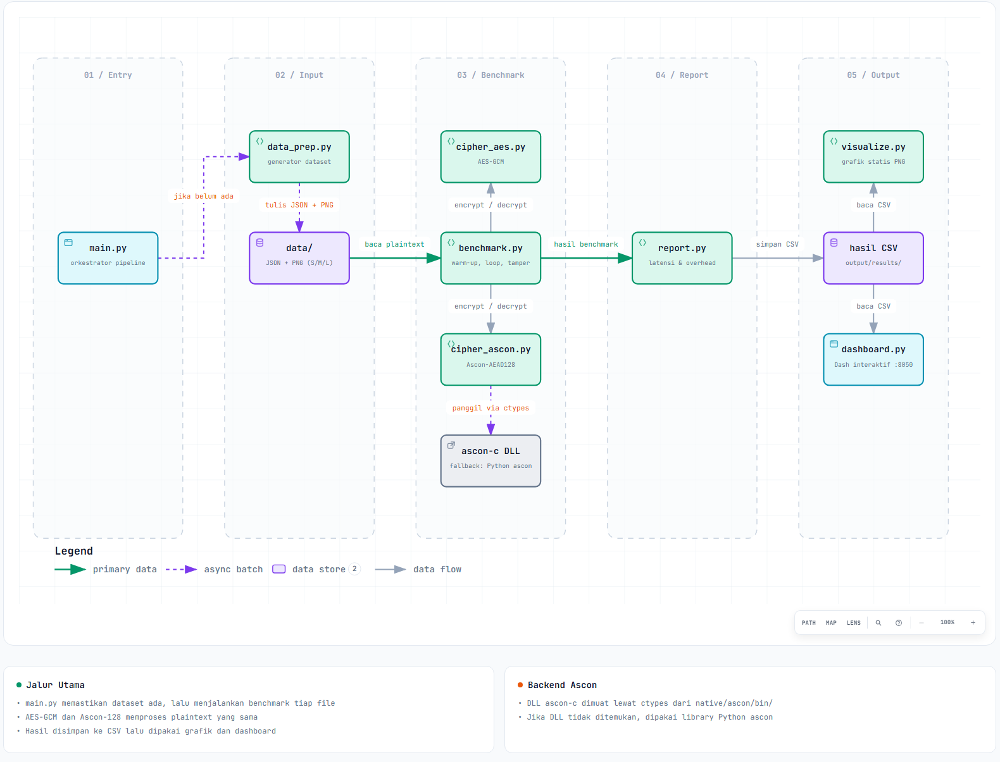

# Cipher Benchmark: AES-GCM vs Ascon-128

Benchmark Python untuk membandingkan dua algoritma enkripsi terautentikasi (AEAD), **AES-GCM** (pycryptodome) dan **Ascon** (implementasi C lewat `ctypes`), pada file JSON dan gambar PNG dengan berbagai ukuran. Proyek ini adalah tugas kelompok mata kuliah Keamanan Sistem Informasi (KSI), Kelompok 1, 3SI1.

Hasil diukur dan divisualisasikan lewat tiga cara: file CSV, grafik statis PNG, dan dashboard web interaktif (Dash).

## Daftar Isi

1. [Ringkasan Cepat](#ringkasan-cepat)
2. [Panduan untuk Agen AI dan Kontributor](#panduan-untuk-agen-ai-dan-kontributor)
3. [Apa yang Diukur](#apa-yang-diukur)
4. [Struktur Repo](#struktur-repo)
5. [Arsitektur dan Alur Data](#arsitektur-dan-alur-data)
6. [Peta Modul](#peta-modul)
7. [Algoritma dan Parameter](#algoritma-dan-parameter)
8. [Instalasi](#instalasi)
9. [Backend Ascon C](#backend-ascon-c)
10. [Menjalankan](#menjalankan)
11. [Dashboard](#dashboard)
12. [Dataset](#dataset)
13. [Output dan Skema CSV](#output-dan-skema-csv)
14. [Contoh Hasil](#contoh-hasil)
15. [Pengujian](#pengujian)
16. [Batasan Pengukuran](#batasan-pengukuran)
17. [Troubleshooting](#troubleshooting)
18. [Dokumen Lain dan Catatan Repo](#dokumen-lain-dan-catatan-repo)

## Ringkasan Cepat

```bash
python -m venv .venv
.venv\Scripts\Activate.ps1          # PowerShell (Windows)
pip install -r requirements.txt

python main.py                      # pipeline penuh: dataset -> benchmark -> CSV -> grafik -> sweep
python dashboard.py                 # dashboard di http://127.0.0.1:8050/
python -m pytest -v                 # 105 tes
```

Syarat: Python 3.10 atau lebih baru (kode memakai sintaks `X | None`). DLL Ascon sudah di-commit untuk **Windows x64**, jadi tidak perlu compiler. Di Linux/macOS, backend C harus di-build sendiri (lihat [Backend Ascon C](#backend-ascon-c)); tanpa itu, kode jatuh ke library Python `ascon` yang lambat dan berbeda varian.

Waktu tunggu `python main.py`: beberapa menit. Bagian terlama adalah size sweep dan file 8 MB dengan 50 iterasi.

## Panduan untuk Agen AI dan Kontributor

Bagian ini merangkum hal yang paling sering membuat orang atau agen salah langkah.

**Titik masuk**

| Tujuan | File / perintah |
|---|---|
| Jalankan pipeline penuh | `python main.py` |
| Jalankan dashboard | `python dashboard.py` (memanggil `src.dashboard_app.build_dash_app`) |
| Benchmark satu file | `src.benchmark.run_single_file_benchmark(...)` |
| Sweep ukuran 1 KB sampai 10 MB | `python -m src.sweep` |
| Skenario realistis | `python -m src.scenarios` |
| Buat ulang dataset | `python -m src.data_prep [--seed N]` |
| Tes | `python -m pytest -v` |

**Aturan penting**

1. **Semua enkripsi lewat satu antarmuka.** `src/aead.py` menyediakan `seal(algorithm, key, nonce, ad, plaintext) -> (ciphertext, tag)` dan `open_sealed(...) -> bytes | None`. Skenario, demo, dan dashboard memakainya. Jangan menulis pemanggilan cipher baru di luar modul ini kecuali ada alasan kuat. Pengecualian yang sudah ada: `src/benchmark.py` memanggil `cipher_aes` dan `cipher_ascon` langsung.
2. **`None` berarti gagal verifikasi.** Fungsi decrypt tidak melempar exception saat tag salah. Mereka mengembalikan `None`. Selalu cek hasilnya.
3. **Ukuran nonce berbeda.** AES-GCM 12 byte, Ascon 16 byte, kunci keduanya 16 byte, tag keduanya 16 byte. Nilainya ada di `src/aead.py` (`NONCE_LEN`, `TAG_LEN`).
4. **Nama algoritma adalah string kunci.** Nilai yang valid: `"AES-GCM"`, `"Ascon-128"`, `"AES-GCM-noNI"` (AES-GCM dengan AES-NI dimatikan, hanya untuk perbandingan akselerasi). Label `"Ascon-128"` dipakai di seluruh CSV dan dashboard, padahal varian sebenarnya lihat poin 5.
5. **Varian Ascon tergantung backend.** Backend C (`libcrypto_aead_asconaead128_ref.dll`) mengimplementasikan **Ascon-AEAD128 (NIST SP 800-232)**. Fallback Python (`ascon.encrypt(..., variant="Ascon-128")`) adalah **Ascon-128 v1.2**. Keduanya tidak kompatibel satu sama lain. `src.cipher_ascon.BACKEND` dan `VARIANT` menyatakan mana yang aktif, dan kolom `Backend` di CSV mencatatnya.
6. **Pengukuran memakai key dan nonce yang dipakai ulang** di dalam satu konfigurasi (loop iterasi) supaya hanya waktu cipher yang terukur. Ini sah untuk timing dan ciphertext-nya dibuang, tetapi jangan menjadikannya pola untuk kode enkripsi sungguhan. Pemakaian ulang nonce justru didemonstrasikan sebagai bahaya di dashboard.
7. **`output/` di-ignore git.** Hanya `output/results/benchmark_results.csv` dan `output/charts/latency_comparison.png` yang ter-track (ditambahkan paksa). File lain di `output/` dibuat ulang oleh pipeline. Jangan commit hasil upload di `output/uploads/`.
8. **Dashboard membaca file hasil saat server start.** Grafik sweep dan panel lingkungan tidak refresh otomatis setelah `python -m src.sweep`. Restart server dashboard.
9. **Jalankan dari root repo.** Import memakai `from src...`, dan `tests/conftest.py` menambahkan root ke `sys.path`.
10. **Komentar berbahasa Indonesia** adalah konvensi kode ini. Pesan commit mengikuti Conventional Commits (`feat:`, `fix:`, `docs:`, `chore:`).

## Apa yang Diukur

- Latensi enkripsi dan dekripsi (rata-rata, median, simpangan baku, CI 95%)
- Overhead ukuran ciphertext (byte dan persen)
- Tampering test: satu bit ciphertext dibalik, dekripsi harus ditolak
- Titik potong ukuran di mana AES-GCM mulai lebih cepat dari Ascon
- Perilaku pada pesan kecil (gaya API), data chunked, dan pengaruh akselerasi hardware (AES-NI)
- Demo keamanan: tamper pada ciphertext/tag/nonce/AD, round trip dengan hash SHA-256, bahaya nonce dipakai ulang, gambar asli vs ciphertext

Pertanyaan riset yang mendasarinya: Ascon dirancang untuk perangkat ringan (IoT). Apakah keunggulan itu muncul di PC desktop modern yang punya AES-NI? Jawaban sementara dari data repo ini ada di [Contoh Hasil](#contoh-hasil).

## Struktur Repo

```text
.
├── main.py                     # Pipeline penuh (CLI)
├── dashboard.py                # Titik masuk dashboard Dash
├── run_large_image.py          # Skrip kecil: benchmark 1 iterasi pada data/images/large.png
├── requirements.txt
├── perencanaan_cipher_benchmark.md   # Dokumen perencanaan awal
├── assets/                     # Aset statis Dash: dashboard.css, a11y.js, font Inter, codeflow.png
├── data/
│   ├── json/                   # small.json (~100 KB), medium.json (~1 MB), large.json (~3 MB)
│   └── images/                 # small.png (~500 KB), medium.png (~3 MB), large.png (~8 MB)
├── native/ascon/
│   ├── bin/libcrypto_aead_asconaead128_ref.dll   # DLL siap pakai (Windows x64), ter-track
│   ├── README.md               # Cara build ulang
│   └── ascon-c/                # Clone upstream, DI-IGNORE git (hanya jika Anda clone sendiri)
├── output/                     # Hasil pipeline, di-ignore git (kecuali 2 file, lihat di atas)
│   ├── results/                # CSV dan environment.json
│   ├── charts/                 # PNG grafik statis
│   └── uploads/<id>/           # File upload dashboard + artifacts/ (ciphertext Base64 dan metadata)
├── src/                        # Kode inti, lihat Peta Modul
└── tests/                      # 105 tes pytest
```

## Arsitektur dan Alur Data



Ada tiga lapisan.

1. **Lapisan cipher**: `cipher_aes.py`, `cipher_ascon.py`, dibungkus `aead.py`.
2. **Lapisan pengukuran**: `benchmark.py` (per file), `sweep.py` (per ukuran), `scenarios.py` (pesan kecil, chunked, akselerasi), `demo_tools.py` (demo keamanan).
3. **Lapisan penyajian**: `report.py` (CSV), `visualize.py` dan `sweep_charts.py` (PNG), `dashboard_*.py` (Dash).

Alur `python main.py`:

1. `check_and_prepare_data()` memeriksa 6 file di `data/`. Jika ada yang hilang, `src/data_prep.py` membuat ulang semuanya (seed 42, deterministik).
2. Untuk tiap dari 6 file, `run_single_file_benchmark` menjalankan AES-GCM lalu Ascon-128 pada plaintext yang sama: 5 warm-up, 50 iterasi terukur (`time.perf_counter`), assert hasil decrypt sama dengan plaintext, lalu tampering test.
3. `report.save_benchmark_results` menulis `output/results/benchmark_results.csv`.
4. `visualize.generate_static_charts` menulis `output/charts/latency_comparison.png`.
5. `report.save_raw_samples` menulis `raw_samples.csv` (satu baris per iterasi). `sweep_charts.generate_boxplot` membuat `latency_boxplot.png`.
6. `env_info.save_env_info` menulis `environment.json` (versi Python, CPU, backend Ascon, `aesni_speedup`).
7. `sweep.run_and_save_sweep` menjalankan size sweep 1 KB sampai 10 MB untuk JSON dan biner. `sweep_charts.generate_sweep_chart` membuat `size_sweep.png`.

`python dashboard.py` tidak bergantung pada `main.py`. Jika `benchmark_results.csv` belum ada, dashboard tetap terbuka dan bisa dipakai lewat upload.

## Peta Modul

### Cipher

| File | Isi |
|---|---|
| `src/cipher_aes.py` | `aes_gcm_encrypt` / `aes_gcm_decrypt` (pycryptodome, parameter `use_aesni`). Decrypt mengembalikan `None` jika tag salah. |
| `src/cipher_ascon.py` | `ascon_128_encrypt` / `ascon_128_decrypt`. Mencari DLL di `native/ascon/bin/` lalu `native/ascon/build/` dan `native/ascon/`, dipanggil lewat `ctypes`. Jika tidak ada, fallback ke library `ascon`. Output enkripsi berupa ciphertext + tag digabung. Konstanta `BACKEND` dan `VARIANT` menyatakan yang aktif. |
| `src/aead.py` | Antarmuka seragam `seal` / `open_sealed`, konstanta `TAG_LEN`, `NONCE_LEN`, `ALGORITHMS`, `ALL_VARIANTS`. Memisahkan tag dari output Ascon. |

### Pengukuran

| File | Isi |
|---|---|
| `src/benchmark.py` | Inti benchmark. `run_single_file_benchmark` (file dari disk), `run_uploaded_file_benchmark` (file upload dashboard, opsional menyimpan ciphertext Base64 dan metadata JSON), `_run_plaintext_benchmark` (dipakai juga oleh sweep). Associated data tetap: `b"cipher-benchmark-metadata"`. |
| `src/sweep.py` | Size sweep: `SWEEP_SIZES` (1 KB, 4 KB, 16 KB, 64 KB, 256 KB, 1 MB, 4 MB, 10 MB), payload `json` dan `binary` (`make_payload`), `summarize_sweep` (rasio Ascon/AES dan p-value Mann-Whitney), `find_crossover` (interpolasi titik potong di skala log). |
| `src/scenarios.py` | Tiga skenario: pesan kecil, chunked, akselerasi. Menyimpan CSV lewat `run_and_save_scenarios`. |
| `src/stats_utils.py` | `ci95_halfwidth` (CI 95% untuk rata-rata) dan `mann_whitney_p` (scipy). |
| `src/env_info.py` | Info lingkungan dan `measure_aesni_speedup`. |
| `src/data_prep.py` | Generator dataset JSON (Faker) dan PNG (noise acak, tanpa kompresi). |

### Laporan dan grafik

| File | Isi |
|---|---|
| `src/report.py` | `save_benchmark_results` (CSV ringkasan, kolom berawalan `_` dibuang) dan `save_raw_samples` (CSV format panjang). Konstanta `RESULTS_DIR`. |
| `src/visualize.py` | `generate_static_charts` (matplotlib). Berisi juga `build_dash_app` versi lama yang **tidak dipakai lagi**; dashboard aktif ada di `src/dashboard_app.py`. |
| `src/sweep_charts.py` | `generate_sweep_chart` dan `generate_boxplot` (matplotlib). |

### Dashboard

| File | Isi |
|---|---|
| `src/dashboard_app.py` | `build_dash_app`: layout utama, upload, benchmark file, grafik latensi dan overhead, unduhan artefak. |
| `src/dashboard_demo.py` | Bagian "Demo Interaktif" (memakai `demo_tools.py`). |
| `src/dashboard_analysis.py` | Bagian "Analisis Ukuran Data dan Lingkungan" (grafik sweep, panel `environment.json`). |
| `src/dashboard_scenarios.py` | Bagian "Skenario Realistis". Tombol cepat menyimpan ke `output/results/quick/`. |
| `src/dashboard_safety.py` | Batas upload 50 MB dan validasi bahwa path berada di `output/uploads/` (`is_within_uploads`, `trusted_upload`). |
| `src/dashboard_theme.py` | Token warna, CSS, layout dasar grafik, warna per algoritma. |
| `src/demo_tools.py` | Logika demo tanpa UI: `tamper_demo`, `roundtrip_demo`, `nonce_reuse_demo`, `image_encryption_demo`. |

## Algoritma dan Parameter

| | AES-GCM | Ascon (label `Ascon-128`) |
|---|---|---|
| Kunci | 16 byte (AES-128) | 16 byte |
| Nonce | 12 byte | 16 byte |
| Tag | 16 byte | 16 byte |
| Implementasi | pycryptodome (C, memakai AES-NI bila ada) | `ascon-c` referensi lewat `ctypes`; fallback library Python `ascon` |
| Varian | NIST GCM | Backend C: Ascon-AEAD128 (SP 800-232). Fallback: Ascon-128 v1.2 |

Parameter benchmark:

| Konteks | Warm-up | Iterasi |
|---|---|---|
| `python main.py` (semua ukuran file) | 5 | 50 |
| Size sweep dari `main.py` / `python -m src.sweep` | 5 | 50 |
| Size sweep dari tombol dashboard | 5 | 20 |
| Upload dashboard, file small | 3 | 10 |
| Upload dashboard, file medium | 1 | 5 |
| Upload dashboard, file large | 0 | 1 |

Kategori ukuran untuk file upload di dashboard: JSON kecil < 500 KB, sedang 500 KB sampai < 2 MB, besar >= 2 MB. Gambar kecil < 1 MB, sedang 1 MB sampai < 6 MB, besar >= 6 MB.

Tampering test di benchmark membalik satu bit pada byte pertama ciphertext lalu memastikan dekripsi mengembalikan `None`.

## Instalasi

```bash
python -m venv .venv
.venv\Scripts\Activate.ps1          # PowerShell. Linux/macOS: source .venv/bin/activate
pip install -r requirements.txt
```

Dependency (`requirements.txt`): `pycryptodome`, `ascon`, `faker`, `pillow`, `numpy`, `pandas`, `matplotlib`, `plotly`, `dash`, `scipy`, `pytest`.

## Backend Ascon C

Clone lalu run sudah cukup di Windows x64 karena DLL ada di `native/ascon/bin/`. Urutan pencarian di `src/cipher_ascon.py`:

1. `native/ascon/bin/libcrypto_aead_asconaead128_ref.dll`, `crypto_aead_asconaead128_ref.dll`, `ascon.dll`
2. `native/ascon/build/` dan `native/ascon/` (`ascon.dll`, `libascon.so`, `libascon.dylib`)
3. Fallback ke library Python `ascon` (lambat dan varian berbeda)

Untuk memastikan backend yang aktif:

```bash
python -c "from src.cipher_ascon import BACKEND, VARIANT; print(BACKEND, '|', VARIANT)"
# C (ascon-c ref) | Ascon-AEAD128 (NIST SP 800-232)
```

Build ulang dari sumber (butuh `git`, `cmake`, compiler C). Ringkasan; detail di `native/ascon/README.md`:

```bash
cd native/ascon
git clone https://github.com/ascon/ascon-c.git
cd ascon-c
git checkout 446347f21b209f3921c65ece70027c366cbe1693
cmake -S . -B build -G "MinGW Makefiles"     # Linux/macOS: tanpa -G
cmake --build build
```

Salin `libcrypto_aead_asconaead128_ref.dll` (`.so` / `.dylib`) ke `native/ascon/bin/`. Untuk `.so` atau `.dylib`, tambahkan nama file itu ke daftar kandidat di `src/cipher_ascon.py`. Folder `ascon-c/` di-ignore git.

## Menjalankan

### Pipeline penuh

```bash
python main.py
```

### Dashboard

```bash
python dashboard.py
```

Buka `http://127.0.0.1:8050/`. Mode debug Dash (menampilkan konsol Werkzeug) hanya aktif jika `DASH_DEBUG=1`.

### Size sweep

```bash
python -m src.sweep
```

Mencetak tabel ringkasan dan titik potong latensi Ascon vs AES-GCM untuk `json` dan `binary`. Menulis `size_sweep.csv`, `size_sweep_raw.csv`, `size_sweep_summary.csv`. Grafiknya (`size_sweep.png`) dibuat oleh `main.py`, bukan oleh perintah ini.

### Skenario realistis

```bash
python -m src.scenarios
```

Menyimpan `small_messages.csv`, `chunked.csv`, `acceleration.csv` di `output/results/`.

- **Pesan kecil (gaya API):** 64 B, 256 B, 1 KB, 4 KB; 2000 pesan per ukuran; nonce baru per pesan; dilaporkan sebagai pesan/detik, latensi median dan P95. Angka pesan/detik dan throughput adalah laju seal saja (waktu loop tidak dihitung).
- **Chunked:** data 8 MB dienkripsi per chunk (4 KB, 64 KB, 1 MB, utuh). Nonce chunk = nonce dasar dengan 8 byte terakhir diganti indeks chunk. AD berisi indeks dan penanda chunk terakhir, sehingga penukaran urutan atau pemotongan aliran terdeteksi. Overhead = 16 byte tag per chunk + nonce dasar.
- **Akselerasi:** `AES-GCM` (dengan AES-NI), `AES-GCM-noNI` (`use_aesni=False`), dan `Ascon-128` pada 1 KB, 64 KB, 1 MB, 10 MB.

### Benchmark satu file

```bash
python -c "from src.benchmark import run_single_file_benchmark; print(run_single_file_benchmark('data/json/small.json', 'json', 'small', warm_ups=3, iterations=10))"
```

## Dashboard

Satu halaman, empat bagian (tautan cepat di header):

1. **Benchmark File** (`#hasil`). Unggah JSON atau gambar (PNG, JPG, JPEG, WEBP, GIF, BMP; maksimal 50 MB), tekan "Jalankan Benchmark". Tampil pratinjau file, kartu ringkasan, grafik latensi enkripsi, latensi dekripsi, overhead ciphertext, tabel hasil, dan unduhan ciphertext Base64 serta metadata JSON per algoritma. Tanpa upload, bagian ini menampilkan isi `benchmark_results.csv`.
2. **Demo Interaktif** (`#demo`). Uji tamper (balik 1 bit pada ciphertext, tag, nonce, atau AD), enkripsi lalu dekripsi balik dengan hash SHA-256 sebelum dan sesudah, demo nonce dipakai ulang (membocorkan XOR plaintext), dan gambar asli vs ciphertext. Memakai file upload bila ada, jika tidak memakai contoh bawaan.
3. **Analisis Ukuran Data dan Lingkungan** (`#analisis`). Grafik size sweep dengan titik potong, panel info lingkungan dari `environment.json`, tombol "Jalankan sweep" (20 iterasi) dan "Unduh CSV sweep".
4. **Skenario Realistis** (`#skenario`). Grafik pesan kecil, chunked, dan akselerasi dari CSV di `output/results/`. Tombol "Jalankan skenario (cepat)" menyimpan hasil ke `output/results/quick/` dan tidak menimpa hasil lengkap.

Keamanan dashboard: path file upload divalidasi harus berada di `output/uploads/` (`dashboard_safety.py`), direktori sesi diturunkan dari file yang sudah tervalidasi, bukan dari state klien, dan ukuran upload dibatasi 50 MB.

Hasil upload disimpan ke `output/results/<nama-file>_<timestamp-UTC>_benchmark.csv`. File asli dan artefak ada di `output/uploads/<id-acak>/` (`artifacts/` berisi `*_ciphertext_base64.txt` dan `*_metadata.json`).

## Dataset

Dibuat oleh `src/data_prep.py` dengan seed 42 (`--seed` untuk mengubah). Semua ukuran adalah target; ukuran akhir mendekati.

| File | Target | Isi |
|---|---|---|
| `data/json/small.json` | 100 KB | Array transaksi palsu (Faker): `transaction_id`, `name`, `amount`, `timestamp`, `category`, `status` |
| `data/json/medium.json` | 1000 KB | idem |
| `data/json/large.json` | 3000 KB | idem |
| `data/images/small.png` | 500 KB | PNG RGB noise acak, `compress_level=0` |
| `data/images/medium.png` | 3000 KB | idem |
| `data/images/large.png` | 8000 KB | idem |

Gambar noise tanpa kompresi sengaja dipilih agar ukuran file presisi dan konsisten. Konsekuensinya, gambar ini bukan representasi foto asli. Dataset sudah ter-commit; `main.py` hanya membuatnya ulang jika ada yang hilang.

## Output dan Skema CSV

| File | Dibuat oleh | Isi |
|---|---|---|
| `output/results/benchmark_results.csv` | `main.py` | Ringkasan per (algoritma, file). Ter-track git. |
| `output/results/raw_samples.csv` | `main.py` | Latensi per iterasi (`Algorithm`, `InputFileName`, `Op` = enc/dec, `Iteration`, `LatencyMs`) |
| `output/results/environment.json` | `main.py` | Python, platform, CPU, versi pycryptodome, `ascon_backend`, `ascon_variant`, `aesni_speedup` |
| `output/results/size_sweep.csv`, `size_sweep_raw.csv` | sweep | Baris ringkasan dan sampel mentah per ukuran |
| `output/results/size_sweep_summary.csv` | sweep | `Kind`, `SizeBytes`, `AesEncMedianMs`, `AsconEncMedianMs`, `RatioAsconOverAes`, `EncPValue` |
| `output/results/small_messages.csv`, `chunked.csv`, `acceleration.csv` | `python -m src.scenarios` | Hasil skenario |
| `output/results/quick/*.csv` | tombol dashboard | Versi cepat skenario |
| `output/results/<nama>_<timestamp>_benchmark.csv` | dashboard | Hasil benchmark file upload |
| `output/charts/latency_comparison.png` | `main.py` | Batang latensi. Ter-track git. |
| `output/charts/latency_boxplot.png` | `main.py` | Sebaran latensi per iterasi |
| `output/charts/size_sweep.png` | `main.py` | Rasio latensi vs ukuran dan titik potong |
| `output/uploads/<id>/` | dashboard | File upload dan artefak |

Kolom `benchmark_results.csv` (satu baris per algoritma per file):

| Kolom | Arti |
|---|---|
| `Algorithm` | `AES-GCM` atau `Ascon-128` |
| `InputFileName`, `FileType`, `SizeCategory` | Nama file, `json` atau `image`, `small`/`medium`/`large` (pada sweep: ukuran byte sebagai teks) |
| `PlaintextSizeBytes`, `CiphertextSizeBytes` | Ukuran sebelum dan sesudah. Ciphertext sudah termasuk tag 16 byte; nonce tidak dihitung |
| `EncLatencyMeanMs`, `EncLatencyMedianMs`, `EncLatencyStdMs`, `EncLatencyCI95Ms` | Statistik enkripsi. Std memakai `np.std` (populasi, `ddof=0`); CI 95% memakai `ddof=1` |
| `DecLatencyMeanMs`, `DecLatencyMedianMs`, `DecLatencyStdMs`, `DecLatencyCI95Ms` | Statistik dekripsi (termasuk verifikasi tag) |
| `Iterations` | Jumlah iterasi terukur |
| `OverheadBytes`, `OverheadPct` | Ciphertext dikurangi plaintext, dan persentasenya |
| `TamperingIntegrityPassed` | `True` bila ciphertext yang dimodifikasi ditolak |
| `Backend` | `pycryptodome` untuk AES-GCM; `C (ascon-c ref)` atau `Python (ascon lib)` untuk Ascon |

## Contoh Hasil

Diambil dari `output/results/size_sweep_summary.csv` dan `environment.json` di repo ini. Mesin: Windows 11, CPU AMD, 16 thread, Python 3.14, pycryptodome 3.23, backend Ascon C, `aesni_speedup` 4,27. **Ini pengukuran satu mesin; angka di mesin lain akan berbeda.**

Rasio = latensi enkripsi median Ascon dibagi AES-GCM. Di bawah 1 berarti Ascon lebih cepat.

| Ukuran | JSON | Biner |
|---|---|---|
| 1 KB | 0,25 | 0,28 |
| 4 KB | 0,41 | 0,31 |
| 16 KB | 0,98 (p = 0,08, tidak signifikan) | 1,53 |
| 64 KB | 2,24 | 1,53 |
| 256 KB | 4,10 | 3,59 |
| 1 MB | 2,64 | 3,19 |
| 10 MB | 3,21 | 3,15 |

Kesimpulan yang didukung data: Ascon menang untuk pesan kecil (di bawah sekitar 16 KB), AES-GCM menang jelas mulai sekitar 64 KB dan sekitar 2,6 sampai 4 kali lebih cepat pada data besar. Sebabnya, pycryptodome memakai AES-NI dan CLMUL di CPU ini, sedangkan Ascon referensi tidak punya akselerasi hardware. Ini berbeda dari literatur perangkat IoT tanpa AES-NI, yang justru ingin ditunjukkan bagian skenario akselerasi.

## Pengujian

```bash
python -m pytest -v
```

105 tes lulus pada repo ini. Cakupan:

| File tes | Yang diuji |
|---|---|
| `test_aead.py`, `test_aead_noni.py` | Antarmuka `seal` / `open_sealed`, varian tanpa AES-NI |
| `test_kat.py` | Test vector resmi: 3 vektor GCM NIST/McGrew-Viega dan 1089 vektor Ascon-AEAD128 |
| `test_benchmark_row.py`, `test_report.py`, `test_stats_utils.py`, `test_env_info.py` | Baris hasil, CSV, statistik, info lingkungan |
| `test_sweep.py`, `test_sweep_charts.py` | Payload, ringkasan, titik potong, grafik |
| `test_scenarios_small.py`, `test_scenarios_chunked.py`, `test_scenarios_save.py` | Tiga skenario dan penyimpanannya |
| `test_demo_tools.py`, `test_dashboard_demo.py` | Logika demo dan bagian demo di dashboard |
| `test_dashboard_analysis.py`, `test_dashboard_scenarios.py`, `test_dashboard_safety.py` | Bagian dashboard lain dan validasi path upload |

**Tes KAT Ascon** membaca `native/ascon/ascon-c/crypto_aead/asconaead128/LWC_AEAD_KAT_128_128.txt`. Folder `ascon-c/` tidak ada di git, jadi pada clone baru `test_ascon_aead128_matches_all_official_kat_vectors` di-**SKIP** (bukan gagal). Untuk mengaktifkannya, clone sumber `ascon-c` ke `native/ascon/ascon-c`. Tes itu dan `test_ascon_rejects_flipped_tag` juga di-skip bila backend bukan C, karena vektor KAT hanya berlaku untuk Ascon-AEAD128.

`tests/conftest.py` memaksa `MPLBACKEND=Agg` agar tes grafik tidak membuka jendela.

## Batasan Pengukuran

- **Salinan output pada pembungkus Ascon.** Pembungkus `ctypes` masih menyalin output (alokasi buffer + `output.raw`), sedangkan pycryptodome tidak. Perkiraan porsinya terhadap latensi enkripsi Ascon (median, 200 pengulangan): sekitar 2,5% pada 16 KB, 14,6% pada 1 MB, 12,9% pada 10 MB. Salinan input sudah dihilangkan (zero-copy); sebelumnya menambah sekitar 2,6% (16 KB), 6,9% (1 MB), 5,6% (10 MB). Angka ini dari satu mesin, bukan konstanta.
- **Urutan pengujian tetap.** Untuk tiap file, AES-GCM dijalankan sebelum Ascon tanpa interleaving, sehingga drift frekuensi CPU bisa memengaruhi selisih kecil di sekitar titik potong.
- **`aesni_speedup`** hanya mengukur AES-NI pada block cipher (`use_aesni=False`). GHASH/CLMUL dipilih terpisah oleh pycryptodome, jadi angka ini meremehkan efek akselerasi hardware penuh.
- **`EncLatencyCI95Ms` / `DecLatencyCI95Ms`** adalah setengah-lebar CI 95% pendekatan normal untuk RATA-RATA (bukan median), dengan asumsi n >= 30. Pada upload dashboard yang hanya 1 sampai 10 iterasi, nilainya tidak berarti secara statistik.
- **Key dan nonce dipakai ulang antar iterasi** pada semua benchmark (khusus untuk timing; ciphertext dibuang).
- **Chunk kecil dan overhead Python.** Pada chunk sangat kecil (mis. 4 KB dari 8 MB, sekitar 2000 panggilan `seal`), overhead pemanggilan Python mendominasi latensi. Angka chunk kecil mencerminkan implementasi ini, bukan algoritmanya saja.
- **Gambar dataset adalah noise acak**, bukan foto. Enkripsi tidak bergantung pada isi, jadi latensi tetap valid, tetapi pratinjau "ciphertext vs asli" lebih bermakna dengan gambar upload.
- **Backend fallback Python** menghasilkan angka latensi dan varian yang tidak sebanding dengan backend C. Selalu periksa kolom `Backend` sebelum membandingkan hasil antar mesin.

## Troubleshooting

| Gejala | Penyebab dan solusi |
|---|---|
| Kolom `Backend` berisi `Python (ascon lib)` dan Ascon sangat lambat | DLL tidak ditemukan atau bukan Windows. Build backend C dan salin ke `native/ascon/bin/`. |
| `pytest` melaporkan 1 tes SKIPPED soal KAT Ascon | `native/ascon/ascon-c/` tidak ada. Normal pada clone baru; clone `ascon-c` untuk menjalankannya. |
| Dashboard menampilkan grafik sweep lama atau kosong | Data dibaca saat server start. Restart `python dashboard.py` setelah `python -m src.sweep`. |
| Dashboard muncul peringatan "CSV benchmark belum ditemukan" | Belum menjalankan `python main.py`. Dashboard tetap bisa dipakai lewat upload. |
| `ModuleNotFoundError: No module named 'src'` | Jalankan dari root repo, bukan dari dalam `src/`. |
| `ImportError` untuk `ascon`, `scipy`, atau `dash` | `pip install -r requirements.txt` di virtual environment yang aktif. |
| Port 8050 dipakai | Hentikan proses lama, atau ubah `port=` di `dashboard.py`. |
| `python main.py` sangat lama | Normal, sweep dan file besar dengan 50 iterasi. Kurangi `iterations` di `main.py` untuk percobaan cepat. |

## Dokumen Lain dan Catatan Repo

- `perencanaan_cipher_benchmark.md`: dokumen perencanaan awal. Sebagian sudah usang (misalnya asumsi Ascon pure Python); rujuk README ini untuk kondisi terbaru.
- `PROPOSAL PROYEK AKHIR.docx`, `planv3.md`, `docs/`: ada di folder kerja tetapi di-ignore git.
- `graphify-out/`: graf pengetahuan kode yang dihasilkan tool `graphify`, ter-track. `GRAPH_REPORT.md` di dalamnya memberi ringkasan struktur kode untuk agen AI. Bukan bagian dari runtime.
- Catatan kerapian yang diketahui: `src/__pycache__/*.pyc` ter-track meski `.gitignore` menyebut `__pycache__/`; `src/visualize.py:build_dash_app` adalah kode dashboard lama yang tidak dipanggil; komentar di `main.py` ("skip large files dan images") sudah tidak sesuai karena semua enam file dijalankan.
- Diagram alur: `assets/codeflow.png`.
